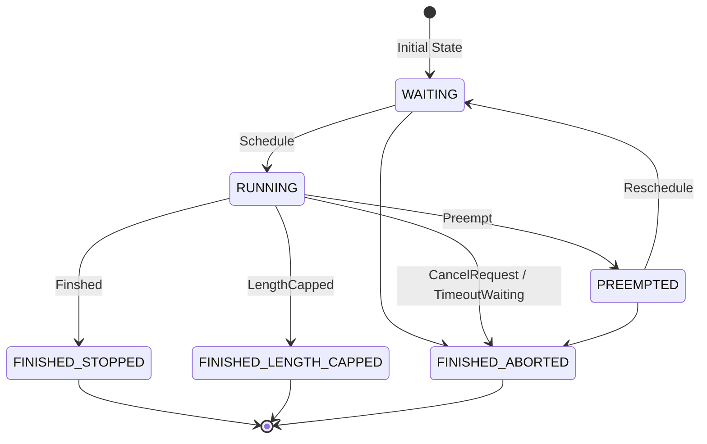

# vLLM V1 Scheduler 调度器策略速通

> 该文章基于 vLLM v.0.10.0 的源码分析

调度系统的核心是一个基于动态 Token 预算的分片处理引擎。

1. 系统初始化时，所有新请求会进入 WAITING 队列等待调度。
2. 在每个调度周期（Step）开始时，系统会分配固定的 Token 预算，随后按照 FCFS 或优先级顺序遍历请求队列。
3. 当请求所需的 Token 数不超过当前预算时（如 Step0 的 R1/R2 请求），该请求会获得全额预算并完整执行；若遇到大请求超出预算（如 Step0 的 R3），则采用分片机制只处理当前预算允许的部分内容。
4. 每次 Step 处理结束后，系统会为每个运行中的请求生成 1 个新 Token（除非触发停止条件），这些 Token 将参与下一轮调度（如 Step1 需要处理 R1/R2 新生成的 Token）。
5. 整个调度过程会循环执行，直到所有请求都达到终止状态


再根据上图，简单介绍调度的基本流程：

1. 最初的请求都尚未被处理
2. 在每个调度 step，会有一定的预算。按照顺序将请求放每个请求
3. Step0: R1、R2 会完整处理所有内容、而在处理 R3 时，只有部分的 token budget 预算，即仅会处理部分。
4. 在一次 step 处理后，会生成一个新的 token，后续会持续生成直到遇到停止符
5. Step1：会处理 R1、R2 的一个 token 输出与 R3 的部分内容。
6. 持续循环，直到处理完所有的请求

# 新请求的处理

对于外部接受的新请求，都会在上层（EngineCoreProc）调用 scheduler.add_request[^1] 函数，并被送入 waiting 队列进行处理。上层调用逻辑可见：

1. 首先，其会调用一系列接口查看 Scheduler 情况
2. 在判断可以调度后，会使用 schedule[^3] 取出一组请求
3. 由 Worker 执行后，又将结果送往此处，并由 update_from_output[^5] 处理后返回

这些请求会存放在 waiting 和 running 队列中，以下是这些请求的的状态机（示意图、不保证完整）：



# 调度 Step

「调度 step」指的是在 Scheduler 中，生成一次推理步骤请求的过程。在这个步骤中，需要基于已有的 running、waiting 队列，按照一定的规则计算出哪些请求会被继续处理、哪些请求会被驱逐、哪些请求可以开始执行。调度的结果 SchedulerOutput 会被送往 Worker 处理。

> 「woosuk 注」Scheduler 中没有「解码阶段」或「预填充阶段」。只有 num_computed_tokens 和 num_tokens_with_spec。
>
> 在每一个 Step，scheduler 都尝试为请求分配 token，以便每个请求的 num_computed_tokens 能够赶上其 num_tokens_with_spec。这足够通用，可以覆盖分块预填充、前缀缓存、投机解码、以及将来「跳转解码」优化。

## 初始化介绍

在调度时，涉及到以下几类请求：

1. 新调度的请求 scheduled_new_reqs，由 waiting 队列中取出的「全新」的请求
2. 抢占恢复的请求 scheduled_resumed_reqs，由 waiting 队列中取出的「抢占」的请求
3. running 队列中的请求 scheduled_running_reqs，第一优先
4. 被抢占的请求 preempted_reqs

首先，其进行了一系列初始化，一个是此次调度涉及到的请求[^6]，一是相关的元数据，以及一些特殊场景的值。

> 「重要的相关元数据」
>
> - req_to_new_block_ids 请求 req_id 到 kv_cache 分配的新 kv cache 的 new_blocks 的 id
> - num_scheduled_tokens 请求 req_id 到 num_new_tokens 即将计算的 token 长度

每次调度前，会计算 token_budget = self.max_num_scheduled_tokens（等同 max_num_batched_tokens[^7]），作为一次调度的最大 token 预算。

## RUNNING requests 的调度

只要总 token 数没超过 token_budget，则取出 running 的每一个元素。

首先需要计算这个请求需要计算的 token 长度 num_new_tokens，计算方式为：

```python
request.num_tokens_with_spec + request.num_output_placeholders - request.num_computed_tokens
```

### num_new_tokens 限制

num_new_tokens 受到多方的限制，如果超过限制则会直接<u>截断</u>部分（被阶段的部分会在下一个 step 处理）：

1. 超过了 long_prefill_token_threshold[^11]
2. 超过了 token_budget
3. 超过了 max_model_len - 1 - num_computed_tokens
4. 还有一些 encoder 相关的约束，略

如果 num_new_token 是 0，则跳过这条请求。

> 请求无法被调度，因为以下原因之一（我们不严格遵循 FCFS 调度策略，允许较低优先级的请求被调度）：
>
> 1. PP>1，并且我们已经调度了所有提示 Token，但它们还没有完成。
> 2. 异步调度,并且请求已经到达其 max_total_tokens 或 max_model_len。
> 3. 编码器预算已耗尽，或编码器缓存已耗尽。

### 处理逻辑

1. 调用 kv_cache_manager.allocate_slots 为新的请求分配 cache 块 new_blocks。

    这个时候，可能会出现没法分配新的 cache 块的情况，也就意味着没有成功调度。

    1. 此时尝试则从 running 队列中进行抢占

        FCFS 队列会从队尾抢占一个，优先级队列则按照请求优先级 r.priority 和请求的到达时间 r.arrival_time 进行抢占。
    2. 抢占完毕后，将被抢占的请求从 kv_cache_manager 中清除缓存
    3. 将被抢占的请求置为 PREEMPTED ，将 num_computed_tokens 置为 0
    4. 将被抢占的请求<u>加入 waiting 队列</u>
    5. 如果被抢占的是自己，也就意味着把自己给放入 waiting 队列，<u>调度失败</u>
2. 调度成功后，将该请求加入 scheduled_running_reqs

    req_to_new_block_ids 将调度的请求和 kv_cache_block 关联

    num_scheduled_tokens 将请求请求和输出的 token 数 num_new_tokens 关联

    preempted_reqs 将被抢占的请求加入

    如果是结构化输出，structured_output_request_ids 将请求与 req_index 关联

    如果是投机解码，XXX

    如果是 Encoder，XXX

## WAITING 队列的调度

> 首先观察是否曾有抢占，如果有抢占则说明 running 队列已经满了，无须再调度 Waiting。

### 处理逻辑

调度 waiting 队列时，会使用一个临时的 RequestQueue 来收集被<u>跳过的请求</u>，并将这些请求放入队头。

1. 取出 waiting 的队头

    1. 对于处于 WAITING_FOR_REMOTE_KVS 状态的请求，尝试观察是否等到了 KV，否则跳过
    2. 如果状态是 WAITING_FOR_FSM （结构化输出才有），则 TODO 否则跳过
    3. 如果是 LoRA，则检查 TODO 跳过
2. 所有从 waiting 队列中取出的请求，其状态会被更新为 WAITING
3. 接着，尝试为新计算内容分配 block，若没有空间则终止调度（而在 running 队列中会尝试抢占）。
4. 最后，将该请求从 waiting 队列<u>放入 running 队列</u>：

    1. 如果是被抢占状态 PREEMPTED ，则将其放入 scheduled_resumed_reqs

        如果是等待状态 WAITING ，则放入 scheduled_new_reqs
    2. 关联请求 id 与 kv cache block，req_to_new_block_ids
5. 最后，将请求置为 <u>RUNNING 状态</u>

    更新 num_computed_tokens、num_cached_tokens 等字段

### KV Connector 相关逻辑

num_external_computed_tokens 与 load_kv_async

获取以及计算的缓存，若 request.num_computed_tokens == 0 ， 说明该请求尚未初始化缓存：

1. 首先从 kv_cache_manager.get_computed_blocks 获取本地 KV Cache num_new_local_computed_tokens
2. 接着，尝试从 KV Connecotr 中获取 num_external_computed_tokens KV Cache

    如果需要异步加载，则会将请求置为 WAITING_FOR_REMOTE_KVS，并跳过（后续再处理该请求）
3. 总缓存数为两者相加 num_new_local_computed_tokens + num_external_computed_tokens
4. 通过计算 request 总 token 数 num_token 与总缓存的差，算出需计算的 token 数目： num_new_tokens = request.num_tokens - num_computed_tokens

    同时，根据长 prefill 限制、token_budget 限制、encoder 限制来截断或取消该请求。

## 整理输出 SchedulerOutput

1. 输出之前，还会对将要处理的请求做一些校验
2. 将被调度的请求列表 scheduled_new_reqs 封装到 new_reqs_data 中，并与其他相关元数据（例如 req_id 和 block 的映射）一起拼装为 SchedulerOutput
3. 做一些收尾工作，便于下次调度

    这块目前仅有 KV connector

‍

[^1]: ## add_request

    ​#vLLM/v0.10.0#​

    ```python
    def add_request(self, request: Request) -> None:
        self.waiting.add_request(request)
        self.requests[request.request_id] = request
        if self.log_stats:
            request.record_event(EngineCoreEventType.QUEUED)
    ```
    在等待队列中添加一个请求 Request[^2]，并将 req_id 与该请求关联。

    ‍


[^2]: # Request

    ​`Request` 类是一个核心数据结构，用于表示一个推理请求。

    其包含了这些数据：

    - 请求标识与元数据

      request_id 请求的唯一标识符

      client_index、priority、arrival_time、cache_salt 等元数据
    - 请求参数

      sampling_params 采样参数、pooling_params 池化参数、eos_token_id 结束符

      lora_request LoRA 请求相关内容

      structured_output_request 结构化输出请求
    - 输入数据

      prompt_token_ids 输入的 token ID 列表

      multi_modal_inputs、multi_modal_hashes、multi_modal_placeholders 等多模态相关的数据
    - 状态与事件

      status 表示请求的状态，会随着处理的进行而变化

      events 生命周期事件与 stop_reason
    - 输出数据

      _output_token_ids 输出的 token ID 列表

      _all_token_ids 所有 token<sup>(包括输入和输出)</sup> ID 的列表

      spec_token_ids 特殊 token ID 列表

      由于其希望对外隐藏输出相关成员变量，其提供了 append_output_token_ids 函数，以存储输出 token ID

      ```python
      def append_output_token_ids(
          self,
          token_ids: Union[int, list[int]],
      ) -> None:
          if isinstance(token_ids, int):
              self._output_token_ids.append(token_ids)
              self._all_token_ids.append(token_ids)
          else:
              self._output_token_ids.extend(token_ids)
              self._all_token_ids.extend(token_ids)

      ```
    - 统计信息

      num_prompt_tokens、num_output_tokens 输入输出统计

      num_computed_tokens、num_cached_tokens 处理请求过程中所需数据

      num_nans_in_logits 输出 NaN 的数量，用于异常检测
    - 多模态相关

      如 mm_positions、mm_inputs 等
    - KV transfer 相关的参数

      kv_transfer_params，不清楚具体如何使用

    Request 对象还额外提供了一系列函数，用于组合、判断成员变量的值，例如 num_tokens_with_spec 。

    # Request 状态

    - WAITING 等待中
    - WAITING_FOR_FSM 等待有限状态机处理

      结构化输出时的状态，FSM能够让文本在生成时，强制执行这些约束
    - WAITING_FOR_REMOTE_KVS 等待远程 KV
    - RUNNING 处理中
    - PREEMPTED 抢占swap
    - 完成状态

      - FINISHED_STOPPED
      - FINISHED_LENGTH_CAPPED
      - FINISHED_ABORTED
      - FINISHED_IGNORED

    ‍


[^3]: ## schedule

    ```python
    def schedule(self) -> "SchedulerOutput":
        raise NotImplementedError
    ```
    调度请求以在此调度步骤中进行处理。调度决策是在<u>迭代级别</u>进行的。每个<u>调度步骤</u>对应模型的<u>一次前向传递</u>。因此，此方法会由引擎中的忙循环重复调用。

    本质上，调度器会生成一个 {req_id: num_tokens} 字典<sup>（应该就是对应num_scheduled_tokens这一个字段）</sup>，指定在此调度步骤中<u>为每个请求处理多少个 token</u>，实际上返回的是 SchedulerOutput[^4]。例如：

    - 对于新请求，num_tokens 可以等于 prompt token 的数量
    - 对于逐个自回归生成新 token 的请求<sup>（即decode阶段）</sup>，num_tokens 可以是 1。
    - 在分块预填充、前缀缓存、推测性解码等情况下，num_tokens 可能会介于两者之间。

    此外，调度器还会返回有关每个请求或整个批次的有用数据<sup>（元数据？）</sup>。model runner 将使用此信息来准备模型的输入。


[^4]: ## SchedulerOutput

    ```python
    @dataclass
    class SchedulerOutput:

        # 首次调度的请求列表。
        # 我们在每个worker进程中缓存请求数据，这样就不需要
        # 在每个调度步骤中重新发送它。
        scheduled_new_reqs: list[NewRequestData]
        # 之前已调度的请求列表。
        # 由于请求数据已在worker进程中缓存，
        # 我们只发送差异以最小化通信成本。
        scheduled_cached_reqs: CachedRequestData

        # req_id -> num_scheduled_tokens
        # 为每个请求调度的 token 数量。
        num_scheduled_tokens: dict[str, int]
        # 为所有请求调度的 token 总数。
        # 等于 sum(num_scheduled_tokens.values())
        total_num_scheduled_tokens: int
        # req_id -> spec_token_ids
        # 如果请求没有任何 spec decode token，则不会将其
        # 包含在字典中。
        scheduled_spec_decode_tokens: dict[str, list[int]]
        # req_id -> 需要处理的 encoder 输入索引。
        # 例如，如果一个请求有 [0, 1]，这可能意味着 vision encoder 需要
        # 在当前步骤处理该请求的第 0 和第 1 个图像。
        scheduled_encoder_inputs: dict[str, list[int]]
        # 每个 KV 缓存组中所有请求的公共前缀块的数量。
        # 这可用于级联注意力。
        num_common_prefix_blocks: list[int]

        # 在上一步和当前步骤之间完成的请求 ID。
        # 这用于通知工作进程已完成的请求，
        # 以便它们可以释放这些请求的缓存状态。
        finished_req_ids: set[str]
        # (req_id, encoder_input_index) 元组的列表。
        # 用于释放 encoder 缓存。
        free_encoder_input_ids: list[tuple[str, int]]

        # 请求 ID 到其在批次中的索引的字典
        # 用于填充下一个 token 位掩码
        structured_output_request_ids: dict[str, int]
        # 整个批次的位掩码
        grammar_bitmask: Optional[npt.NDArray[np.int32]]

        # KV Cache Connector 元数据。
        kv_connector_metadata: Optional[KVConnectorMetadata] = None
    ```

[^5]: ## update_from_output

    ```python
    def update_from_output(
        self,
        scheduler_output: "SchedulerOutput",
        model_runner_output: "ModelRunnerOutput",
    ) -> dict[int, "EngineCoreOutputs"]:
        raise NotImplementedError
    ```
    在 model runner 处理完调度好的请求后，会调用此方法。model runner 的输出来自生成的 token id、下一步的 draft token id 等。scheduler 利用这些信息更新其状态，检查已完成的请求，并为每个请求返回输出。

    返回的结果是客户端索引和输出响应的字典，包含了来自该客户端的每个请求的输出。
