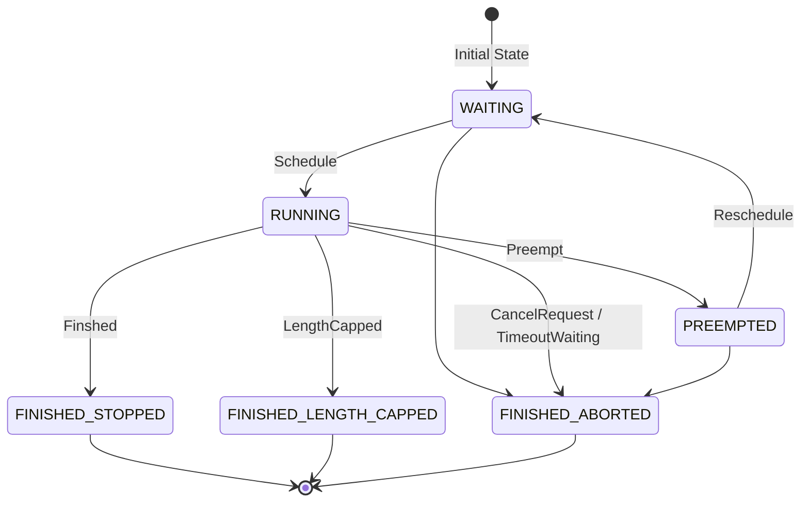

# vLLM V1 Scheduler 调度器策略速通

> 该文章基于 vLLM v.0.10.0 的源码分析

调度系统的核心是一个基于动态 Token 预算的分片处理引擎。

1. 系统初始化时，所有新请求会进入 WAITING 队列等待调度。
2. 在每个调度周期（Step）开始时，系统会分配固定的 Token 预算，随后按照 FCFS 或优先级顺序遍历请求队列。
3. 当请求所需的 Token 数不超过当前预算时（如 Step0 的 R1/R2 请求），该请求会获得全额预算并完整执行；若遇到大请求超出预算（如 Step0 的 R3），则采用分片机制只处理当前预算允许的部分内容。
4. 每次 Step 处理结束后，系统会为每个运行中的请求生成 1 个新 Token（除非触发停止条件），这些 Token 将参与下一轮调度（如 Step1 需要处理 R1/R2 新生成的 Token）。
5. 整个调度过程会循环执行，直到所有请求都达到终止状态


再根据上图，简单介绍调度的基本流程：

1. 最初的请求都尚未被处理
2. 在每个调度 step，会有一定的预算。按照顺序将请求放每个请求
3. Step0: R1、R2 会完整处理所有内容、而在处理 R3 时，只有部分的 token budget 预算，即仅会处理部分。
4. 在一次 step 处理后，会生成一个新的 token，后续会持续生成直到遇到停止符
5. Step1：会处理 R1、R2 的一个 token 输出与 R3 的部分内容。
6. 持续循环，直到处理完所有的请求

# 新请求的处理

对于外部接受的新请求，都会在上层（EngineCoreProc）调用 scheduler.add_request 函数，并被送入 waiting 队列进行处理。上层调用逻辑可见：

1. 首先，其会调用一系列接口查看 Scheduler 情况
2. 在判断可以调度后，会使用 schedule 取出一组请求
3. 由 Worker 执行后，又将结果送往此处，并由 update_from_output 处理后返回

这些请求会存放在 waiting 和 running 队列中，以下是这些请求的的状态机（示意图、不保证完整）：



# 调度 Step

「调度 step」指的是在 Scheduler 中，生成一次推理步骤请求的过程。在这个步骤中，需要基于已有的 running、waiting 队列，按照一定的规则计算出哪些请求会被继续处理、哪些请求会被驱逐、哪些请求可以开始执行。调度的结果 SchedulerOutput 会被送往 Worker 处理。

> 「woosuk 注」Scheduler 中没有「解码阶段」或「预填充阶段」。只有 num_computed_tokens 和 num_tokens_with_spec。
>
> 在每一个 Step，scheduler 都尝试为请求分配 token，以便每个请求的 num_computed_tokens 能够赶上其 num_tokens_with_spec。这足够通用，可以覆盖分块预填充、前缀缓存、投机解码、以及将来「跳转解码」优化。

## 初始化介绍

在调度时，涉及到以下几类请求：

1. 新调度的请求 scheduled_new_reqs，由 waiting 队列中取出的「全新」的请求
2. 抢占恢复的请求 scheduled_resumed_reqs，由 waiting 队列中取出的「抢占」的请求
3. running 队列中的请求 scheduled_running_reqs，第一优先
4. 被抢占的请求 preempted_reqs

首先，其进行了一系列初始化，一个是此次调度涉及到的请求，一是相关的元数据，以及一些特殊场景的值。

> 「重要的相关元数据」
>
> - req_to_new_block_ids 请求 req_id 到 kv_cache 分配的新 kv cache 的 new_blocks 的 id
> - num_scheduled_tokens 请求 req_id 到 num_new_tokens 即将计算的 token 长度

每次调度前，会计算 token_budget = self.max_num_scheduled_tokens（等同 max_num_batched_tokens），作为一次调度的最大 token 预算。

## RUNNING requests 的调度

只要总 token 数没超过 token_budget，则取出 running 的每一个元素。

首先需要计算这个请求需要计算的 token 长度 num_new_tokens，计算方式为：

```python
request.num_tokens_with_spec + request.num_output_placeholders - request.num_computed_tokens
```

### num_new_tokens 限制

num_new_tokens 受到多方的限制，如果超过限制则会直接<u>截断</u>部分（被阶段的部分会在下一个 step 处理）：

1. 超过了 long_prefill_token_threshold
2. 超过了 token_budget
3. 超过了 max_model_len - 1 - num_computed_tokens
4. 还有一些 encoder 相关的约束，略

如果 num_new_token 是 0，则跳过这条请求。

> 请求无法被调度，因为以下原因之一（我们不严格遵循 FCFS 调度策略，允许较低优先级的请求被调度）：
>
> 1. PP>1，并且我们已经调度了所有提示 Token，但它们还没有完成。
> 2. 异步调度,并且请求已经到达其 max_total_tokens 或 max_model_len。
> 3. 编码器预算已耗尽，或编码器缓存已耗尽。

### 处理逻辑

1. 调用 kv_cache_manager.allocate_slots 为新的请求分配 cache 块 new_blocks。

    这个时候，可能会出现没法分配新的 cache 块的情况，也就意味着没有成功调度。

    1. 此时尝试则从 running 队列中进行抢占

        FCFS 队列会从队尾抢占一个，优先级队列则按照请求优先级 r.priority 和请求的到达时间 r.arrival_time 进行抢占。
    2. 抢占完毕后，将被抢占的请求从 kv_cache_manager 中清除缓存
    3. 将被抢占的请求置为 PREEMPTED ，将 num_computed_tokens 置为 0
    4. 将被抢占的请求<u>加入 waiting 队列</u>
    5. 如果被抢占的是自己，也就意味着把自己给放入 waiting 队列，<u>调度失败</u>
2. 调度成功后，将该请求加入 scheduled_running_reqs

    req_to_new_block_ids 将调度的请求和 kv_cache_block 关联

    num_scheduled_tokens 将请求请求和输出的 token 数 num_new_tokens 关联

    preempted_reqs 将被抢占的请求加入

    如果是结构化输出，structured_output_request_ids 将请求与 req_index 关联

    如果是投机解码，XXX

    如果是 Encoder，XXX

## WAITING 队列的调度

> 首先观察是否曾有抢占，如果有抢占则说明 running 队列已经满了，无须再调度 Waiting。

### 处理逻辑

调度 waiting 队列时，会使用一个临时的 RequestQueue 来收集被<u>跳过的请求</u>，并将这些请求放入队头。

1. 取出 waiting 的队头

    1. 对于处于 WAITING_FOR_REMOTE_KVS 状态的请求，尝试观察是否等到了 KV，否则跳过
    2. 如果状态是 WAITING_FOR_FSM （结构化输出才有），则 TODO 否则跳过
    3. 如果是 LoRA，则检查 TODO 跳过
2. 所有从 waiting 队列中取出的请求，其状态会被更新为 WAITING
3. 接着，尝试为新计算内容分配 block，若没有空间则终止调度（而在 running 队列中会尝试抢占）。
4. 最后，将该请求从 waiting 队列<u>放入 running 队列</u>：

    1. 如果是被抢占状态 PREEMPTED ，则将其放入 scheduled_resumed_reqs

        如果是等待状态 WAITING ，则放入 scheduled_new_reqs
    2. 关联请求 id 与 kv cache block，req_to_new_block_ids
5. 最后，将请求置为 <u>RUNNING 状态</u>

    更新 num_computed_tokens、num_cached_tokens 等字段

### KV Connector 相关逻辑

num_external_computed_tokens 与 load_kv_async

获取以及计算的缓存，若 request.num_computed_tokens == 0 ， 说明该请求尚未初始化缓存：

1. 首先从 kv_cache_manager.get_computed_blocks 获取本地 KV Cache num_new_local_computed_tokens
2. 接着，尝试从 KV Connecotr 中获取 num_external_computed_tokens KV Cache

    如果需要异步加载，则会将请求置为 WAITING_FOR_REMOTE_KVS，并跳过（后续再处理该请求）
3. 总缓存数为两者相加 num_new_local_computed_tokens + num_external_computed_tokens
4. 通过计算 request 总 token 数 num_token 与总缓存的差，算出需计算的 token 数目： num_new_tokens = request.num_tokens - num_computed_tokens

    同时，根据长 prefill 限制、token_budget 限制、encoder 限制来截断或取消该请求。

## 整理输出 SchedulerOutput

1. 输出之前，还会对将要处理的请求做一些校验
2. 将被调度的请求列表 scheduled_new_reqs 封装到 new_reqs_data 中，并与其他相关元数据（例如 req_id 和 block 的映射）一起拼装为 SchedulerOutput
3. 做一些收尾工作，便于下次调度

    这块目前仅有 KV connector

‍
